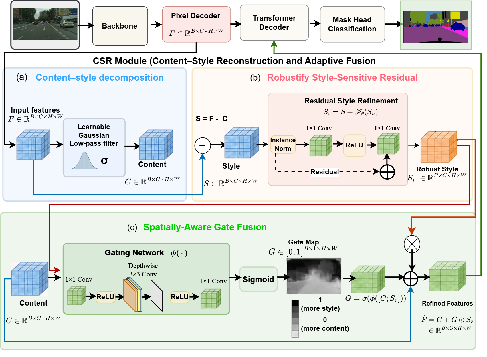

# CSRFormer: Content–Style Reconstruction Transformer for Domain-Generalized Urban Scene Semantic Segmentation

Official PyTorch implementation of **CSRFormer**.

<p align="center">
  
</p>

## Overview

Semantic segmentation models trained on one urban dataset often fail on unseen cities, weather conditions, and synthetic imagery. CSRFormer addresses this **domain generalization** setting for mask-classification transformers: the model is trained on Cityscapes only and evaluated without adaptation on BDD100K, Mapillary Vistas, GTA5, and ACDC (fog, night, rain, snow).

Our diagnostic analysis of Mask2Former shows that most of the out-of-domain degradation is already present in the pixel-decoder features, before the transformer decoder. It also shows that common channel-statistics techniques such as Instance Normalization are incompatible with mask classification: mask prediction is a per-channel dot product between query embeddings and pixel features, so unequal channel rescaling breaks it.

CSRFormer therefore inserts a lightweight **Content–Style Reconstruction (CSR)** module between the pixel decoder and the transformer decoder of Mask2Former:

1. **Spatial-frequency decomposition.** A learnable depthwise Gaussian low-pass filter extracts the content component *C*; the high-frequency residual is the style component *S*.
2. **Style robustification.** Instance Normalization followed by a zero-initialised residual transform is applied to the style component only, producing *S<sub>r</sub>*.
3. **Spatially gated fusion.** A per-pixel gate *G* ∈ [0,1]<sup>1×H×W</sup>, shared across channels, decides where robustified style is re-injected:

<p align="center"><b>F̂ = C + G ⊙ S<sub>r</sub></b></p>

Because the gate scales every channel equally at each pixel, CSR preserves the channel structure that mask prediction depends on. The module adds **179,457 parameters** (≈0.17% of the Swin-B model) and is near-identity at initialization.

> **Naming note.** In the code, the CSR module is implemented as `CSFD` in
> [`Mask2Former/mask2former/modeling/csfd/csfd_module.py`](Mask2Former/mask2former/modeling/csfd/csfd_module.py)
> and is enabled with `MODEL.CSFD.ENABLED: True`.

## Repository structure

```
CSRFormer/
├── docs/                          # installation guide and figures
└── Mask2Former/
    ├── train_net.py               # training / evaluation entry point
    ├── custom_configs/training/   # CSRFormer and baseline configs
    ├── mask2former/
    │   ├── modeling/csfd/         # CSR module
    │   ├── modeling/meta_arch/    # CSR integration (mask_former_head.py)
    │   └── data/datasets/         # registration of BDD100K, GTA5, Mapillary, ACDC
    └── tools/                     # weight conversion utilities
```

## Quick start

Tested with Python 3.8, PyTorch 2.4.0 (CUDA 12.1), and detectron2 0.6 on a single RTX 3090 (24 GB).

**1. Install** (full instructions in [docs/INSTALL.md](docs/INSTALL.md))

```bash
git clone https://github.com/nsohpeter/CSRFormer.git
cd CSRFormer/Mask2Former
pip install torch==2.4.0 torchvision==0.19.0 --index-url https://download.pytorch.org/whl/cu121
pip install 'git+https://github.com/facebookresearch/detectron2.git'
pip install -r requirements.txt
cd mask2former/modeling/pixel_decoder/ops && sh make.sh && cd -
```

**2. Prepare data and pretrained weights.** Download [Cityscapes](https://www.cityscapes-dataset.com/), [BDD100K](https://bdd-data.berkeley.edu/), [GTA5](https://download.visinf.tu-darmstadt.de/data/from_games/), [Mapillary Vistas v2.0](https://www.mapillary.com/dataset/vistas) and [ACDC](https://acdc.vision.ee.ethz.ch/) from their official sources. All target datasets are mapped to the 19 Cityscapes classes and registered by [`register_custom_datasets.py`](Mask2Former/mask2former/data/datasets/register_custom_datasets.py), where the dataset paths are set. The pretrained Swin-B backbone is described in [docs/INSTALL.md](docs/INSTALL.md#6-pretrained-backbone).

**3. Train on Cityscapes**

```bash
python train_net.py \
  --config-file custom_configs/training/csfd_v1_run2_swinb_90k.yaml \
  --num-gpus 1
```

**4. Evaluate on an unseen domain**

```bash
python train_net.py \
  --config-file custom_configs/training/csfd_v1_run2_swinb_90k.yaml \
  --num-gpus 1 --eval-only \
  MODEL.WEIGHTS path/to/model_final.pth \
  DATASETS.TEST '("bdd100k_sem_seg_val",)'
```

Registered evaluation targets: `bdd100k_sem_seg_val`, `gta5_sem_seg_val`, `mapillary_vistas_sem_seg_val`, `acdc_fog_sem_seg_val`, `acdc_night_sem_seg_val`, `acdc_rain_sem_seg_val`, `acdc_snow_sem_seg_val`, and `acdc_sem_seg_val` (all ACDC conditions). Training takes about 15.5 hours and the GTA5 evaluation about 2 hours on a single RTX 3090.

## Citation

If you find this work useful, please cite:

```bibtex
@article{csrformer,
  title   = {CSRFormer: Content--Style Reconstruction Transformer for Domain-Generalized Urban Scene Semantic Segmentation},
  author  = {TODO},
  journal = {TODO},
  year    = {TODO}
}
```

## Contact

For questions about the paper or code, please open a [GitHub issue](https://github.com/nsohpeter/CSRFormer/issues) or contact:

- **Peter Nsoh**: [Apiahpetertoch@gmail.com](mailto:Apiahpetertoch@gmail.com) (University of Electronic Science and Technology of China)

## Acknowledgements

This project is built on [Mask2Former](https://github.com/facebookresearch/Mask2Former) and [detectron2](https://github.com/facebookresearch/detectron2). We thank the authors for releasing their code.

## License

The Mask2Former code base is released under the MIT License (see [`Mask2Former/LICENSE`](Mask2Former/LICENSE)). The CSR module and modifications in this repository are released under the same license.